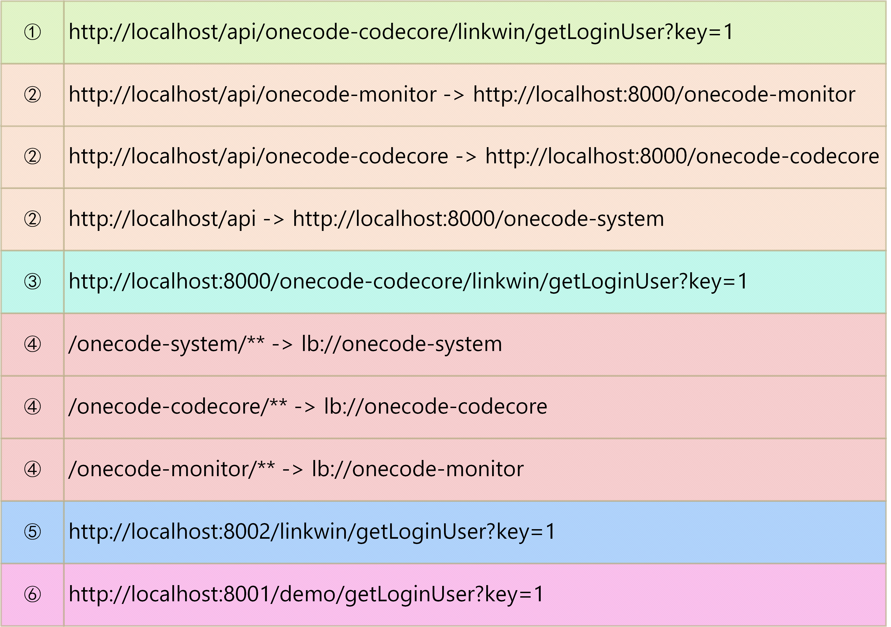

### 一、微服务的概述

##### 1、应用发展过程

- 单体应用（All in One）：容错性、并发性较弱
- 分布式架构：高容错、高可用
- 微服务架构：分布式架构的一种，注重服务的拆分自治
- Serverless 架构
- Service Mesh 架构

##### 2、服务架构概述

- 定义：将单个应用程序拆分为多个小型服务，每个服务都可以独立开发、部署和运行
- 优点：提高系统的灵活性、可扩展性、可维护性和可测试性
- 缺点：复杂度提高、服务间通信成本增加

### 二、涉及相关组件

##### 1、项目常用组件

- 负载均衡/反向代理：Nginx、LB、F5
  - WEB服务器
  - 反向代理服务器
  - 负载均衡、灰度发布
- 网关路由：Spring Cloud GateWay、Zuul 
  - 后端入口服务，接收流量并转发至相关应用
  - 鉴权和认证
- 注册中心：Nacos、Eureka、ZooKeeper 、Consul
  - Nacos：注册中心 + 配置中心
- 流量控制：Sentinel、Hystrix
  - Sentinel：流量控制和熔断降级
- 服务调用：OpenFeign、Feign
- 负载均衡：Spring Cloud Loadbalancer、Ribbon
- 分布式事务：Seata
- 消息队列：RocketMQ、RabbitMQ、Kafka
- 数据缓存：Redis
  - 业务缓存、分布式锁、异常拦截...
- 服务跟踪：SkyWalking、Zipkin
- 数据存储：MySQL、Oracle、SQLServer、PostgreSQL、SQLite....
  - 分库分表：MyCat2 / ShardingSphere
  - 读写分离
  - 冷备热备：Keepalived
- 服务部署：Docker、K8S
- 云技术：EIP、DNS、SSL、CDN、LB、ECS、ECI、RDS、OSS

##### 2、组件版本依赖

https://github.com/alibaba/spring-cloud-alibaba/wiki/%E7%89%88%E6%9C%AC%E8%AF%B4%E6%98%8E

### 三、主要组件介绍

##### 1、Spring Cloud GateWay

- 核心概念：
  1. 路由(Route)：路由是构建网关的基本模块，由ID、目标URI、一系列的断言和过滤器组成，如果断言为true则匹配该路由。
  2. 断言(Predicate)：可以匹配HTTP请求中的内容，如果请求与断言相匹配则进行路由。
  3. 过滤(Filter)：使用过滤器，可以在请求被路由前或者之后对请求进行修改。
- 默认情况下GateWay会根据注册中心注册的服务列表，以注册中心上微服务名为路径创建动态路由进行转发，从而实现动态路由的功能。
- 过滤器：认证和鉴权、全局日志记录...

##### 2、Nacos

- Naming Configuration Service：注册中心 + 配置中心
- Nacos默认自带的是嵌入式数据库 derby（org.apache.derby）
- 集群架构：默认Nacos使用嵌入式数据库（内存）实现数据的存储。所以，如果启动多个默认配置下的Nacos节点，数据存储是存在一致性问题的。为了解决这个问题，Nacos采用了集中式存储的方式来支持集群化部署，目前只支持MySQL的存储。

##### 3、Sentinel

- 分为两部分：
  1. 核心库：Java客户端，不依赖任何框架/库，能够运行于所有Java运行时环境，同时对Dubbo/SpringCloud等框架也有较好的支持。
  2. 控制台：Dashboard，基于SpringBoot开发，打包后可以直接运行，不需要额外的Tomcat等容器。
- 启动控制台：Sentinel默认的启动端口为8080，可自定义运行端口：-Dserver.port=8849
- 懒加载机制：执行一次访问才会显示管控的服务列表
- 规则持久化：初始默认情况下，一旦重启服务端应用，Sentinel规则将消失，生产环境需要将配置规则进行持久化。

### 四、项目内容示例

### 五、组件启动步骤

##### 1、Nacos

- 下载地址：https://github.com/alibaba/nacos/releases/download/1.4.1/nacos-server-1.4.1.zip
- 开发模式下单例模式启动即可：进入`bin`目录，命令窗口运行`startup.cmd -m standalone`

##### 2、Sentinel

- 下载地址：https://github.com/alibaba/Sentinel/releases/download/v1.8.0/sentinel-dashboard-1.8.0.jar
- 打开JAR包所在文件夹，命令窗口运行`java -Dserver.port=8849 -jar sentinel-dashboard-1.8.0.jar`

##### 3、Redis

- 安装Redis后可自定义设置下访问密码，指定配置文件启动Redis服务端`redis-server.exe redis.windows.conf`
- RedisGUI下载地址：https://redis.com/redis-enterprise/redis-insight/#insight-form